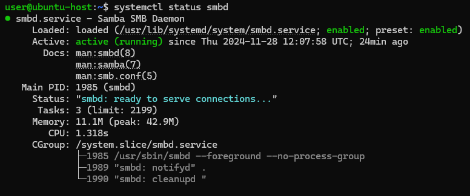
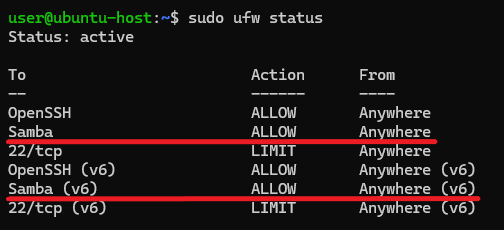

# Configuring CentOS Stream 9 to Connect to Samba Resources on Ubuntu 24.04
This guide focuses on connecting a CentOS Stream 9 server to a file resource shared via Samba on an Ubuntu 24.04 server. Whether you're managing a multi-OS infrastructure or simply need to link these systems for a specific task, this step-by-step tutorial will help you set up and access shared folders effortlessly.
## Configuring Samba on Ubuntu 24.04
First, update the package lists for the system's package manager:
```
sudo apt update
```
Install Samba using the ```apt``` package manager:
```
sudo apt install samba
```
Check the Samba status to ensure it's installed correctly:
```
systemctl status smbd
```



## Configuring the Firewall
If your firewall is enabled, allow Samba traffic:
```
sudo ufw allow Samba
```
Check the UFW status:
```
sudo ufw status
```
The output list must contain a line corresponding to the permission rules for Samba.



Continued on the [iolloi.icu](https://iolloi.icu/index.php/2024/12/01/configuring-centos-stream-9-connect-samba-on-ubuntu/)
